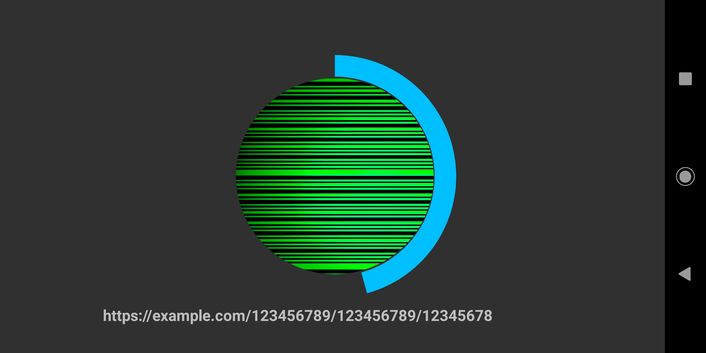

# NOOB_Reader (repeating signal)

Android Visible Light Communication (VLC) reader application developed for Nokia 5.1. This application reads data from
the programmable LED on Zolertia Firefly mote running contiki-ng / EAP-NOOB. The LED transmits an Out-of-band (OOB) message
in the form of a URL.

Contiki-ng and EAP-NOOB project: https://github.com/eduingles/coap-eap-noob.

Uses oob_led.c transmitter, e.e., the repeating transmitter.

# Screen capture

Licensing
---------
Copyright (c) 2019, Aalto University
All rights reserved.

Redistribution and use in source and binary forms, with or without
modification, are permitted provided that the following conditions are met:
- Redistributions of source code must retain the above copyright
  notice, this list of conditions and the following disclaimer.
- Redistributions in binary form must reproduce the above copyright
  notice, this list of conditions and the following disclaimer in the
  documentation and/or other materials provided with the distribution.
- Neither the name of the Aalto University nor the names of the contributors may be used to endorse or
  promote products derived from this software without specific prior
  written permission.

THIS SOFTWARE IS PROVIDED BY THE COPYRIGHT HOLDERS AND CONTRIBUTORS "AS IS"
AND ANY EXPRESS OR IMPLIED WARRANTIES, INCLUDING, BUT NOT LIMITED TO, THE
IMPLIED WARRANTIES OF MERCHANTABILITY AND FITNESS FOR A PARTICULAR PURPOSE
ARE DISCLAIMED. IN NO EVENT SHALL AALTO UNIVERSITY BE LIABLE FOR ANY
DIRECT, INDIRECT, INCIDENTAL, SPECIAL, EXEMPLARY, OR CONSEQUENTIAL DAMAGES
(INCLUDING, BUT NOT LIMITED TO, PROCUREMENT OF SUBSTITUTE GOODS OR SERVICES;
LOSS OF USE, DATA, OR PROFITS; OR BUSINESS INTERRUPTION) HOWEVER CAUSED AND
ON ANY THEORY OF LIABILITY, WHETHER IN CONTRACT, STRICT LIABILITY, OR TORT
(INCLUDING NEGLIGENCE OR OTHERWISE) ARISING IN ANY WAY OUT OF THE USE OF
THIS SOFTWARE, EVEN IF ADVISED OF THE POSSIBILITY OF SUCH DAMAGE.

Installation using Android Studio
---------
1. Configure OpenCV for Android.
2. Once you have OpenCV working, replace the contents of colorblobdetect sample folder with these files.

